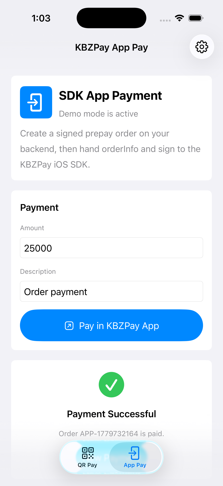
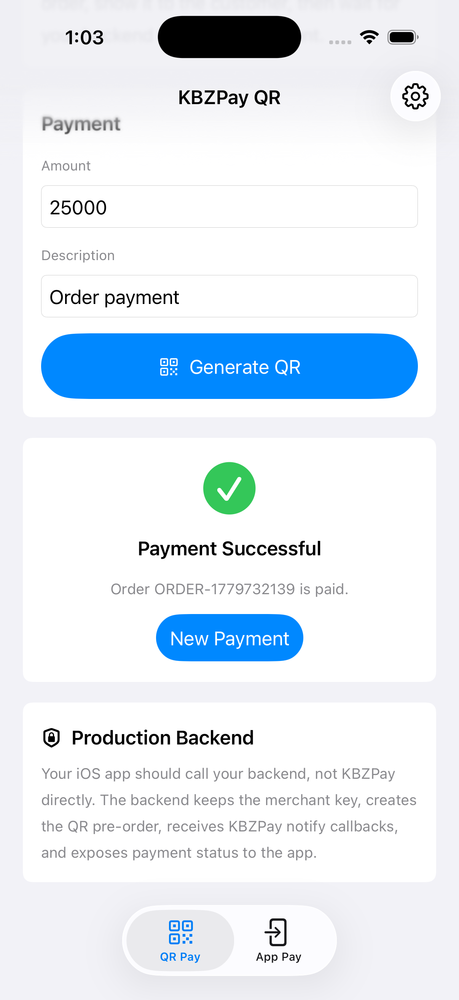
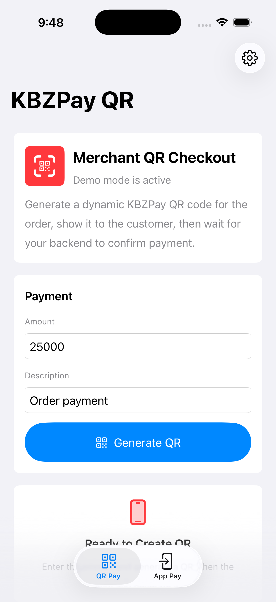

# KBZPay iOS Integration Guide

This sample project demonstrates two KBZPay payment flows for an iOS SwiftUI app:

- **App Pay**: Opens the KBZPay app using the official `KBZPayAPPPay` iOS SDK.
- **QR Pay**: Shows a dynamic QR code in your app and waits for backend confirmation.

The app uses SwiftUI + MVVM and keeps all merchant signing on your backend.

## Screenshot
| Demo Screenshot | Demo Screenshot |
|:-------------------------:|:-------------------------:|
|  |  |
|  |

## Official KBZPay API

Use the official KBZPay API web portal for UAT dashboard access, API docs, SDK downloads, merchant configuration, and credentials:

```text
https://wap.kbzpay.com/pgw/uat/api/#/en/dashboard
```

Related official docs used for this sample:

```text
https://wap.kbzpay.com/pgw/uat/api/#/en/docs/InApp/in-app-download-en
https://wap.kbzpay.com/pgw/uat/api/#/en/docs/QRPay/api-precreate-qr-en
https://wap.kbzpay.com/pgw/uat/api/#/en/docs/PWA/scenes-PWA-en
```

## Important Rule

Never put your KBZPay merchant key, sign key, or app key inside the iOS app.

Your iOS app should call your backend. Your backend should call KBZPay, sign requests, receive payment callbacks, and confirm payment status.

```text
iOS app
 -> your backend
 -> KBZPay API

KBZPay callback
 -> your backend

iOS app
 -> your backend to verify payment
```

## Project Structure

```text
KBZPayQRDemo/
  KBZPayQRDemo.xcodeproj
  KBZPayQRDemo/
    Frameworks/
      KBZPayAPPPay.xcframework
    Models/
      KBZPayAppPayment.swift
      KBZPayQRPayment.swift
    Services/
      KBZPayAppAPIClient.swift
      KBZPayAppPayService.swift
      KBZPayQRAPIClient.swift
      QRCodeGenerator.swift
      AppConfiguration.swift
    ViewModels/
      AppPayViewModel.swift
      CheckoutViewModel.swift
    Views/
      AppPayView.swift
      CheckoutView.swift
      PaymentHomeView.swift
      SettingsView.swift
```

## App Pay Flow

Use this flow when the user taps a button in your iOS app and pays in the KBZPay app.

```text
1. User taps "Pay in KBZPay App"
2. iOS calls your backend:
   POST /payments/kbzpay/app
3. Backend creates a KBZPay prepay order
4. Backend returns orderInfo + sign + signType
5. iOS calls KBZPay SDK
6. KBZPay app opens
7. User completes payment
8. KBZPay returns to your app via URL scheme
9. iOS verifies final status with your backend
10. App unlocks premium or completes order
```

The iOS SDK call is handled in:

```text
KBZPayQRDemo/Services/KBZPayAppPayService.swift
```

The important method is:

```swift
let controller = PaymentViewController()
controller.startPay(
    withOrderInfo: payment.orderInfo,
    signType: payment.signType,
    sign: payment.sign,
    appScheme: appScheme
)
```

## QR Pay Flow

Use this flow when you want the app to display a QR code.

```text
1. User taps "Generate QR"
2. iOS calls your backend:
   POST /payments/kbzpay/qr
3. Backend creates a KBZPay QR prepay order
4. Backend returns qrContent
5. iOS renders qrContent as a QR code
6. User scans QR with KBZPay
7. KBZPay notifies your backend
8. iOS polls backend for status
9. App completes order or unlocks premium
```

QR rendering is handled in:

```text
KBZPayQRDemo/Services/QRCodeGenerator.swift
```

## Required iOS Setup

The app includes the KBZPay SDK as:

```text
KBZPayQRDemo/Frameworks/KBZPayAPPPay.xcframework
```

The project also includes these `Info.plist` entries:

```xml
<key>LSApplicationQueriesSchemes</key>
<array>
    <string>kbzpay</string>
</array>

<key>CFBundleURLTypes</key>
<array>
    <dict>
        <key>CFBundleURLName</key>
        <string>KBZPayCallback</string>
        <key>CFBundleURLSchemes</key>
        <array>
            <string>com.example.KBZPayQRDemo</string>
        </array>
    </dict>
</array>
```

For your real app, replace:

```text
com.example.KBZPayQRDemo
```

with your own app URL scheme, usually your bundle identifier.

## Backend Requirements

Your backend should provide these endpoints:

```text
POST /payments/kbzpay/app
POST /payments/kbzpay/qr
GET  /payments/kbzpay/qr/{orderId}/status
GET  /payments/kbzpay/orders/{orderId}
POST /payments/kbzpay/notify
```

### App Pay Response

The iOS app expects `POST /payments/kbzpay/app` to return:

```json
{
  "merchantOrderId": "ORDER-123",
  "orderInfo": "appid=...&merch_code=...&nonce_str=...&prepay_id=...&timestamp=...",
  "sign": "SERVER_GENERATED_SHA256",
  "signType": "SHA256"
}
```

### QR Pay Response

The iOS app expects `POST /payments/kbzpay/qr` to return:

```json
{
  "id": "local-payment-id",
  "merchantOrderId": "ORDER-123",
  "prepayId": "kbz-prepay-id",
  "qrContent": "KBZPay QR string",
  "expiresAt": "2026-05-23T10:30:00Z"
}
```

### Status Response

The iOS app expects status endpoints to return:

```json
{
  "status": "paid"
}
```

Supported values:

```text
pending
paid
failed
expired
```

## Backend Signing

Your backend should build `orderInfo` like this:

```text
appid=YOUR_APP_ID&merch_code=YOUR_MERCH_CODE&nonce_str=RANDOM&prepay_id=PREPAY_ID&timestamp=TIMESTAMP
```

Then sign it:

```text
SHA256(orderInfo + "&key=" + MERCHANT_KEY)
```

The iOS app should only receive the final `orderInfo`, `sign`, and `signType`.

## Premium Unlock Example

For premium content, do not unlock only from the app callback. Always verify with your backend.

Recommended flow:

```text
1. User taps "Unlock Premium"
2. App creates KBZPay payment through backend
3. User pays in KBZPay
4. KBZPay notifies backend
5. Backend marks order as paid
6. App asks backend if order is paid
7. App unlocks premium
```

Example backend user record:

```json
{
  "userId": "USER-123",
  "isPremium": true,
  "premiumSource": "kbzpay",
  "premiumOrderId": "ORDER-123",
  "premiumUnlockedAt": "2026-05-23T10:30:00Z"
}
```

## Running the Sample App

Open:

```text
KBZPayQRDemo.xcodeproj
```

The sample app starts in **Demo Mode**, so it can run without a backend.

To use your real backend:

1. Open the app.
2. Tap the settings gear.
3. Turn off **Use Demo Mode**.
4. Enter your backend base URL, for example:

```text
https://api.yourdomain.com
```

5. Enter your app scheme, for example:

```text
com.yourcompany.yourapp
```

6. Test App Pay on a physical iPhone with KBZPay installed.

## Testing

Simulator builds work, but real KBZPay App Pay requires:

- A physical iPhone
- KBZPay installed
- Valid KBZPay UAT or production merchant credentials
- A reachable backend URL
- A configured iOS callback URL scheme

Build command:

```bash
xcodebuild -project KBZPayQRDemo.xcodeproj -scheme KBZPayQRDemo -destination 'generic/platform=iOS Simulator' build
```

## Common Problems

### KBZPay app does not open

Check:

- KBZPay is installed on the test iPhone.
- `LSApplicationQueriesSchemes` contains `kbzpay`.
- You are testing App Pay on a real device.

### App does not receive callback

Check:

- `CFBundleURLTypes` contains your app scheme.
- The same app scheme is passed to the SDK.
- KBZPay merchant configuration allows your callback scheme.

### Payment succeeds but premium does not unlock

Check:

- KBZPay notify callback reached your backend.
- Backend marked the order as `paid`.
- iOS verified order status after returning from KBZPay.

### Invalid sign

Check:

- Merchant key is correct for UAT or production.
- Parameters are in the exact order required by KBZPay.
- `orderInfo` used for signing is exactly the same string sent to iOS.
- Do not URL-encode or reorder parameters after signing unless KBZPay docs require it.

## Production Checklist

- Replace demo bundle identifier.
- Replace callback URL scheme.
- Use production KBZPay credentials.
- Use HTTPS backend URL.
- Store merchant key only on backend.
- Verify KBZPay notify signatures on backend.
- Confirm order status before unlocking premium.
- Log order IDs and KBZPay transaction IDs.
- Handle duplicate notify callbacks safely.
- Add retry and expiration handling.
